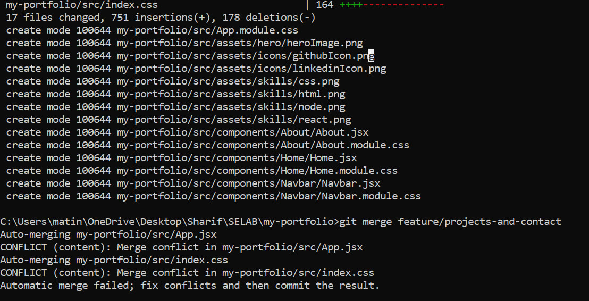
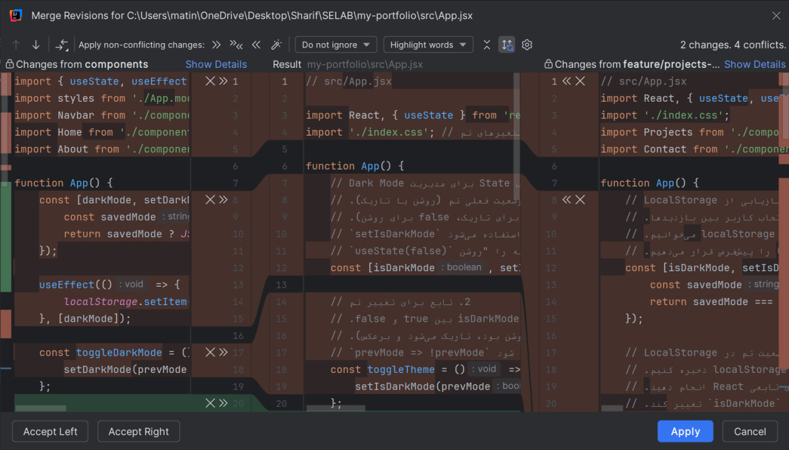
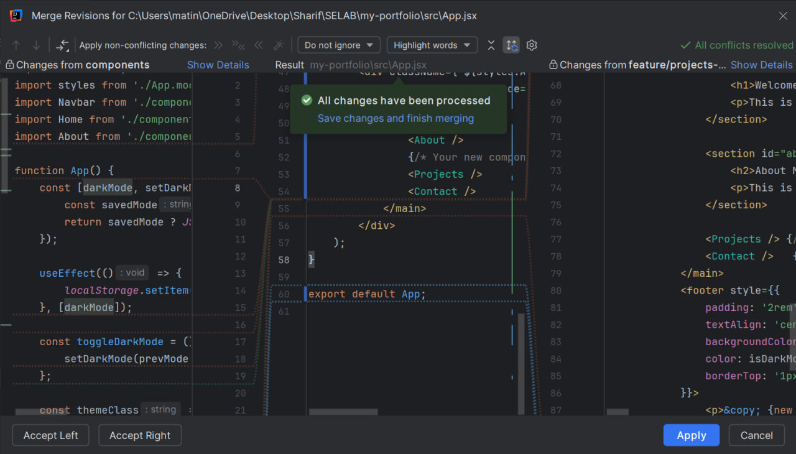
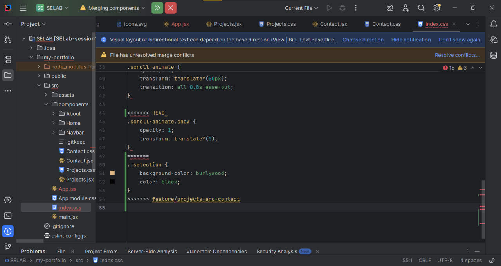
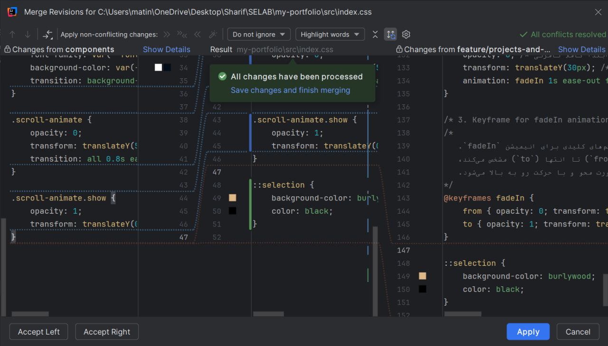

# گزارش جامع پیاده‌سازی آزمایش ۱: پورتفولیوی شخصی (React)

## ۱. مقدمه و هدف پروژه
این پروژه یک وب‌سایت پورتفولیوی شخصی تک‌صفحه‌ای (SPA) است که با استفاده از کتابخانه React توسعه یافته است. هدف از این پروژه، نمایش مهارت‌ها، سوابق کاری و پروژه‌های انجام شده در قالب یک رابط کاربری مدرن، واکنش‌گرا (Responsive) و کاربرپسند بوده است. علاوه بر جنبه‌های فنی فرانت‌اند، پیاده‌سازی اصولی مدیریت نسخه با Git، کار تیمی، و راه‌اندازی استقرار خودکار (CI/CD) از اهداف کلیدی این پروژه به شمار می‌رود.

## ۲. تکنولوژی‌ها و ابزارهای استفاده شده
*   هسته اصلی: React.js (استفاده از Functional Components و Hooks)
*   مدیریت استایل‌ها: ترکیبی از CSS Modules (مانند Navbar.module.css) و فایل‌های CSS سراسری/معمولی با استفاده گسترده از متغیرهای CSS (CSS Variables)
*   مدیریت نسخه و کار تیمی: Git, GitHub
*   استقرار مستمر (CI/CD): GitHub Actions و GitHub Pages

## ۳. معماری و کامپوننت‌های پروژه
ساختار پروژه به صورت ماژولار طراحی شده و شامل کامپوننت‌های مجزای زیر است:

### کامپوننت ریشه (App.jsx)
این کامپوننت به عنوان دربرگیرنده اصلی عمل می‌کند و وظایف زیر را بر عهده دارد:
*   مدیریت تم تاریک/روشن: با استفاده از useState و useEffect، وضعیت تم کاربر در localStorage ذخیره و خوانده می‌شود. تغییر تم با اضافه یا حذف کردن کلاس light به document.body اعمال می‌شود تا استایل‌های سراسری تغییر کنند.
*   انیمیشن‌های اسکرول: استفاده از IntersectionObserver برای شناسایی زمان ورود عناصر کلاس .scroll-animate به صفحه وب و اعمال کلاس .show برای ایجاد انیمیشن‌های Fade-in.

### کامپوننت ناوبری (Navbar.jsx)
*   یک نوار ناوبری واکنش‌گرا که در موبایل به صورت منوی همبرگری (Hamburger Menu) در می‌آید (menuOpen state).
*   دکمه تغییر تم (☀️/🌙) در این کامپوننت قرار دارد که تابع toggleDarkMode را از طریق Props دریافت کرده و اجرا می‌کند. مشکل چیدمان این دکمه با اصلاح استایل‌های .menu و استفاده از align-items: center برطرف شد.

### کامپوننت خانه (Home.jsx)
*   بخش هیرو (Hero Section) که شامل معرفی اولیه ("Hi, I'm Matin Mohammadi") و دکمه‌های تماس است.
*   مشکل ناخوانا بودن متن در حالت Light Mode با جایگزینی رنگ‌های Hardcode شده با متغیر var(--color-text) در کلاس .title برطرف گردید.

### کامپوننت درباره من (About.jsx)
*   شامل دو بخش اصلی است: معرفی نقش‌ها (توسعه‌دهنده فرانت‌اند، بک‌اند و طراح رابط کاربری) و نمایش مهارت‌های کلیدی (HTML, CSS, React, Node.js) به همراه آیکون‌های مربوطه.

### کامپوننت پروژه‌ها (Projects.jsx)
*   پروژه‌ها به صورت داینامیک از یک آرایه (projectList) خوانده و رندر می‌شوند.
*   هر کارت پروژه شامل عنوان، توضیحات، تکنولوژی‌های استفاده شده (به صورت Tag) و لینک مشاهده است.
*   استایل کارت‌ها با شعاع حاشیه (Border-radius) و رنگ پس‌زمینه متناسب با سیستم طراحی هماهنگ شده است.

### کامپوننت تماس (Contact.jsx)
*   یک فرم تماس شامل فیلدهای نام، ایمیل و پیام کاربر
*   متد handleSubmit برای جلوگیری از رفتار پیش‌فرض فرم (e.preventDefault()) تعبیه شده است تا در آینده به یک API متصل شود.

## ۴. ویژگی‌های کلیدی و چالش‌های حل شده

*   سیستم تم یکپارچه: در ابتدا تمپلیت فقط در نوار ناوبری تغییر می‌کرد. با انتقال منطق به App.jsx و تغییر کلاس روی document.body، و همچنین استانداردسازی متغیرهای CSS (مانند `--color-background`, `--color-text`, `--color-primary`) در فایل index.css، تغییر تم به صورت کاملا سراسری و یکنواخت اعمال شد.
*   هماهنگی استایل‌ها (CSS Alignment): فایل‌های `contact.css` و `project.css` بازنویسی شدند تا از نظر فواصل (margin/padding)، افکت‌های Hover، و گردی حاشیه‌ها کاملا با بقیه کامپوننت‌ها (مثل About و Home) هماهنگ شوند.

## ۵. فرآیند توسعه، Git و کار تیمی
این پروژه با رعایت اصول مهندسی نرم‌افزار و کار تیمی توسعه یافته است:
*   مدیریت شاخه‌ها (Branches): استفاده از حداقل ۴ شاخه مجزا (مانند report, components, deployment, features) برای توسعه موازی ویژگی‌ها
*   کامیت‌های ساختاریافته: ثبت بیش از ۲۰ کامیت معنادار با توضیحات واضح که روند تکامل پروژه را نشان می‌دهد.
*   محافظت از شاخه اصلی: مسدود کردن Push مستقیم به شاخه master. تمامی تغییرات از طریق ثبت درخواست ادغام (Pull Request) و پس از بررسی اعمال شدند.
*   مدیریت تداخل (Conflicts): در حین ادغام کدهای توسعه‌داده شده در شاخه components با استایل‌های جدید، حداقل ۲ تداخل ایجاد شد که با بررسی دقیق تغییرات روی فایل‌های CSS و App.jsx با موفقیت رفع گردید.

## ۶. استقرار و CI/CD
برای دسترسی‌پذیری دائمی پروژه، فرآیند استقرار خودکار پیاده‌سازی شد:
*   یک فایل گردش کار (Workflow) با استفاده از GitHub Actions پیکربندی شد.
*   با هر بار Merge شدن یک Pull Request جدید به شاخه `master`، پروژه به صورت خودکار بیلد (Build) شده و نسخه استاتیک تولید شده روی GitHub Pages مستقر می‌گردد.

## ۷. راهنمای راه‌اندازی محلی
برای اجرای این پروژه در محیط توسعه محلی:
```bash
# 1. کلون کردن مخزن
git clone https://github.com/SELab-Farnam-Matin/SELab-session1.git

# 2. ورود به پوشه پروژه
cd my-portfolio

# 3. نصب وابستگی‌ها
npm install

# 4. اجرای سرور توسعه محلی
npm run dev
```

## ۸. برنچ‌های استفاده‌شده

| برنچ                 | هدف برنچ                                                        | وضعیت مرج         |
|----------------------|-----------------------------------------------------------------|-------------------|
| master               | برنچ اصلی تولید (Production) - نسخه پایدار و نهایی پروژه        | فعال              |
| deployment           | برنچ اختصاصی برای GitHub Pages - استقرار خودکار سایت استاتیک    | مرج شده به master |
| feature-setup        | اضافه کردن فیچرها و قابلیت‌های اولیه مانند دارک‌مد و انیمیشن‌ها | مرج شده به master |
| projects-and-contact | اضافه کردن قسمت‌های پروژه و ارتباط                              | مرج شده به master |
| components           | اضافه کردن صفحات درباره من, ناوبری و هماهنگ کردن استایل آن‌ها   | مرج شده به master |
| report               | نوشتن گزارش پروژه در قالب مارک‌داون در فایل README.md           | مرج شده به master |

تمامی برنچ‌های deployment و components پس از تکمیل به master مرج شده‌اند.

### رفع Merge Conflict ‌ها در طول پروژه

در طول توسعه پروژه، دو بار با Merge Conflict واقعی مواجه شدیم و آن‌ها را به صورت دستی و اصولی رفع کردیم:

#### 1. Merge Conflict در App.jsx (هنگام مرج کردن برنچ feature/projects-and-cpntact به برنچ components)

در حین مرج کردن این دو شاخه، بعلت اینکه ویژگی هایی از 
App.jsx 
توسط فرنام در برنچ components و ویژگی های دیگر توسط متین در برنچ 
feature/projects-and-contact 
پیاده سازی شده بودند، به کانفلیکت برخوردیم.



برای رفع آن، از ویژگی های UI نرم افزار Intellij IDEA استفاده کردیم و تغییرات لازم را در نسخه نهایی نگهداشتیم.



#### 2. Merge Conflict در index.css (هنگام مرج کردن برنچ feature/projects-and-contact به برنچ components)

مشابه همان مراحلی که در بخش قبلی طی کردیم، کافلیکت ایجاد شده در فایل index.css را نیز با استفاده از ویژگی های IDE برطرف کردیم. 




## آدرس سایت لانچ‌شده (GitHub Pages)
سایت استاتیک پروژه با موفقیت روی GitHub Pages دیپلوی شده و در آدرس زیر قابل مشاهده است:

```
https://selab-farnam-matin.github.io/SELab-session1/
```


## پرسش‌ها

## ۱) پوشه‌ی .git چیست؟ چه اطلاعاتی در آن ذخیره می‌شود؟ با چه دستوری ساخته می‌شود؟


پوشه‌ی `.git` قلب هر مخزن Git است. وقتی یک پروژه را با Git مدیریت می‌کنید، تمام اطلاعات تاریخچه، تنظیمات و وضعیت مخزن در این پوشه‌ی مخفی ذخیره می‌شود.

### ساخته شدن با دستور:
```bash
git init
```

### یا وقتی مخزن را از راه دور کپی می‌کنید:
```
git clone <url>
```

این دستور یک پوشه‌ی `.git` در دایرکتوری جاری می‌سازد و آن را به یک مخزن Git تبدیل می‌کند.

### اطلاعات ذخیره‌شده در `.git`:

| فایل / پوشه | محتوا                                                           |
|-------------|-----------------------------------------------------------------|
| `HEAD` | اشاره‌گر به branch یا commit جاری                               |
| `config` | تنظیمات محلی مخزن (نام، ایمیل، remote و ...)                    |
| `objects/` | تمام داده‌های پروژه (فایل‌ها، commit ها، درخت‌ها) به صورت فشرده |
| `refs/` | اشاره‌گرهای branch ها و tag ها                                  |
| `index` | فایل stage (تغییراتی که آماده‌ی commit هستند)                   |
| `logs/` | تاریخچه‌ی تغییرات HEAD و branch ها                              |
| `COMMIT_EDITMSG` | پیام آخرین commit                                               |
| `MERGE_HEAD` | در زمان merge، اشاره‌گر به commit مبدأ                          |

هرگز محتوای این پوشه را دستی تغییر ندهید.


---


## ۲) منظور از atomic بودن در atomic commit و atomic pull-request چیست؟

اتمیک بودن یک چیز به معنای این است که نمی توان آن را به بخش های کوچکتری تقسیم کرد. 

Atomic Commit به کامیتی گفته می شود که در آن تنها یک تغییر منطقی واحد قرار داشته باشد. به طور مثال اگر می خواهیم یک ویژگی به محصول اضافه کنیم، آن کامیت باید تنها شامل کدهای آن ویژگی باشد نه اینکه همزمان کدهای مربوط به یک باگ را هم در آن کامیت قرار داد. مزیت این کار این است که بعدا می توان با revert کردن آن کامیت تاثیراتش را خنثی کرد. 

Atomic Pull-Request به یک پول ریکوئستی گفته می شود که در آن تمرکز بر یک ویژگی خاص است. به این شکل می توان فرآیند code review را ساده سازی کرد و همچنین در صورت نیاز، با rollback کردن به سادگی می توان تغییرات را خنثی کرد. 


---
## ۳) تفاوت دستورهای fetch و pull و merge و rebase و cherry-pick


### `git fetch`
تغییرات remote را **دانلود** می‌کند، اما هیچ تغییری در working directory یا branch جاری ایجاد **نمی‌کند**. فقط اطلاعات را به‌روز می‌کند.
bash
```
git fetch origin
```

### `git pull`
ترکیب `fetch` + `merge` است. تغییرات remote را دانلود کرده و **بلافاصله** با branch جاری ادغام می‌کند.
bash
```
git pull origin main
```

### `git merge`
دو branch را با هم ادغام می‌کند و یک **merge commit** جدید می‌سازد. تاریخچه‌ی هر دو branch حفظ می‌شود.
bash
```
git merge feature-branch
```

### `git rebase`
commit های یک branch را **بازنویسی** کرده و آن‌ها را روی نوک branch دیگری قرار می‌دهد. تاریخچه خطی و تمیزتر می‌شود، اما commit های قدیمی بازنویسی می‌شوند.
bash
```
git rebase main
```
از `rebase` روی branch های عمومی (shared) استفاده نکنید.

### `git cherry-pick`
یک یا چند commit **مشخص** را از هر جایی از تاریخچه انتخاب کرده و روی branch جاری اعمال می‌کند.
bash
```
git cherry-pick <commit-hash>
```
کاربرد آن در این است که وقتی فقط یک bugfix خاص از branch دیگری را می‌خواهید، نه کل آن branch.

### جدول مقایسه:

| دستور | دانلود از remote | ادغام | بازنویسی تاریخچه | انتخابی |
|-------|:-:|:-:|:-:|:-:|
| `fetch` | ✅ | ❌ | ❌ | ❌ |
| `pull` | ✅ | ✅ | ❌ | ❌ |
| `merge` | ❌ | ✅ | ❌ | ❌ |
| `rebase` | ❌ | ✅ | ✅ | ❌ |
| `cherry-pick` | ❌ | ✅ | ❌ | ✅ |


---
## ۴) تفاوت دستورهای reset و revert و restore و switch و checkout


### checkout: 
یک دستور نسبتا قدیمی در گیت است که برای جابجایی میان شاخه ها به کار می رود. همچنین در بازگردانی فایل ها به حالت قبلی کاربرد دارد که امروزه برای این امر دستورات دیگری مورد استفاده قرار می گیرند. 

### switch: 
فقط برای جابجایی میان شاخه ها یا ایجاد شاخه جدید استفاده می شود. 
### restore:
برای بازگردانی تغییرات در working directory به وضعیت قبلی استفاده می شود.
### reset:
برای بازگشت در تاریخچه استفاده می شود و شاخه فعلی را به کامیت قبلی می برد. بسته به فلگ های مختلف می تواند تغییرات را نگه دارد یا کلا پاک کند.
### revert:
رفتاری مانند reset دارد، با این تفاوت که بجای بازگردانی کامیت قبلی، یک کامیت جدید می سازد با تغییرات کامیت قبلی. به این شکل به طور امن تری می توان در تاریخچه عقب و جلو رفت و تغییرات مهم را نیز حفظ کرد. 


---
## ۵) منظور از stage یا همان index چیست؟ دستور stash چه کاری انجام می‌دهد؟


### Stage یا Index چیست؟
Stage (یا Index) یک **ناحیه‌ی میانی** بین working directory و مخزن است. تغییراتی که با `git add` علامت‌گذاری می‌شوند وارد stage می‌شوند و در commit بعدی ثبت خواهند شد.


Working Directory  →  git add  →  Stage (Index)  →  git commit  →  Repository

- تغییراتی که هنوز `add` نشده‌اند: **Unstaged**
- تغییراتی که `add` شده‌اند: **Staged**
- تغییراتی که `commit` شده‌اند: بخشی از تاریخچه

bash
```
git add file.txt        # اضافه کردن به stage
git status              # مشاهده‌ی وضعیت stage
git diff --staged       # مشاهده‌ی تفاوت‌های staged
```
---

### دستور `git stash`
`stash` تغییرات **ذخیره‌نشده** (هم staged و هم unstaged) را به صورت موقت کنار می‌گذارد تا working directory تمیز شود، بدون اینکه commit بسازید.

bash
```
git stash           # ذخیره‌ی موقت تغییرات
git stash list      # مشاهده‌ی لیست stashها
git stash pop       # بازگرداندن آخرین stash و حذف آن از لیست
git stash apply     # بازگرداندن آخرین stash بدون حذف از لیست
git stash drop      # حذف آخرین stash
```
**مثال کاربردی:** روی یک feature کار می‌کنید که نیمه‌کاره است. یک باگ فوری گزارش می‌شود. با `stash` کارهای نیمه‌کاره را کنار می‌گذارید، باگ را رفع می‌کنید، و بعد با `stash pop` به کار قبلی برمی‌گردید.


---
## ۶) مفهوم snapshot به چه معناست؟ ارتباط آن با commit چیست؟

اسنپ شات به معنای یک نما از وضعیت فعلی فایل ها است که در گیت نگهداری می شود. برای بهینه سازی فضای ذخیره سازی، در گیت این اسنپ شات ها بجای اینکه تمامی فایل ها را نگه دارند، تنها تغییرات را ذخیره می کنند و برای مابقی بخش ها، یک لینک به فایل قبلی دارند. 

هر کامیت در اصل، اشاره گری به یک اسنپ شات است. با رفتن به یک کامیت، در واقع به اسنپ شاتی که کامیت به آن اشاره می کند می رویم.


---
## ۷) تفاوت‌های local repository و remote repository چیست؟

### Local Repository
مخزنی که **روی سیستم شما** قرار دارد. تمام تاریخچه، branch ها و commit ها در پوشه‌ی `.git` روی ماشین محلی ذخیره می‌شوند. بدون اینترنت هم می‌توانید با آن کار کنید.

### Remote Repository
مخزنی که روی یک **سرور خارجی** (مثل GitHub، GitLab، Bitbucket) قرار دارد. برای همکاری تیمی و به اشتراک‌گذاری کد استفاده می‌شود.

### جدول مقایسه:

| ویژگی           | Local Repository            | Remote Repository       |
|-----------------|-----------------------------|-------------------------|
| محل ذخیره       | سیستم شما                   | سرور خارجی              |
| نیاز به اینترنت | ❌                           | ✅                       |
| همکاری تیمی     | ❌                           | ✅                       |
| پشتیبان‌گیری    | ❌                           | ✅                       |
| سرعت عملیات     | سریع                        | وابسته به شبکه          |
| دستورات مرتبط   | `commit`, `branch`, `merge` | `push`, `pull`, `fetch` |

### دستورات ارتباط با Remote:
bash
```
git remote add origin <url>   # اضافه کردن remote
git remote -v                 # مشاهده‌ی remoteهای تعریف‌شده
git push origin main          # ارسال تغییرات به remote
git pull origin main          # دریافت تغییرات از remote
git clone <url>               # کپی کردن یک remote repository به صورت local
```
